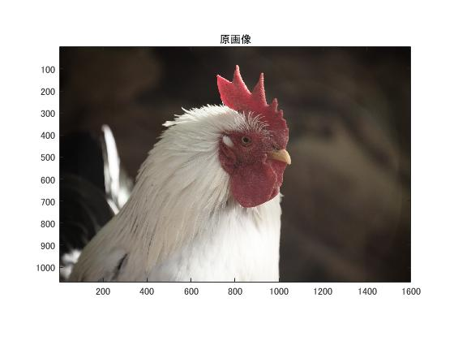

#課題1　標本化間隔と空間解像度

「」を原画像とする．この画像は縦画素x，横画素yのディジタルカラー画像である．

	ORG=imread('pic1.jpg'); % 原画像の入力
	imagesc(ORG); axis image; % 画像の表示

で画像を読み込み，縦横軸と共に原画像の表示を行う．表示した画像を図1に示す．  
  
図1．原画像

	IMG = imresize(ORG,0.5); % 画像の縮小(1/2)
	IMG2 = imresize(IMG,2,'box'); % 画像の拡大

で原画像の1/2サンプリングを行う．原画像を0.5倍したものをIMGとし，これを2倍することでサンプリングされる．
拡大する際，'box'指定を行い，箱型の単純補完をする．
結果を図2に示す．
  
図2．1/2サンプリング

	IMG = imresize(IMG,0.5); % 画像の縮小(1/4)
	IMG2 = imresize(IMG,4,'box'); % 画像の拡大

で原画像の1/4サンプリングを行う．IMGは原画像の1/2なので，これを更に0.5倍することで1/4になる．  
これを4倍すること1/4でサンプリングが完了する．結果を図3に示す．  
  
図3．1/4サンプリング

同様に，IMGを1/2にし，それを8,16,32倍にするという手順で1/8,1/16,1/32サンプリングを行う．  
結果は図4,図5,図6に示す．

	IMG = imresize(IMG,0.5); % 画像の縮小(1/8)
	IMG2 = imresize(IMG,8,'box'); % 画像の拡大
  
図4．1/8サンプリング

	IMG = imresize(IMG,0.5); % 画像の縮小(1/16)
	IMG2 = imresize(IMG,16,'box'); % 画像の拡大
  
図5．1/16サンプリング

	IMG = imresize(IMG,0.5); % 画像の縮小(1/32)
	IMG2 = imresize(IMG,32,'box'); % 画像の拡大
  
図6．1/32サンプリング

よって，サンプリング幅が大きくなっていくと，それに対応するだけ同じ画素の塊ができてモザイク状の歪みが発生する．箱型の画素の数が解像度となっている．  
サンプリングの間隔が狭くなればなるほどモザイクの一つ一つの大きさは小さくなり，個数も増加していく．個数が多い，つまり解像度が高いと，画像は見やすくなり，内容を目で認識しやすくなる．
