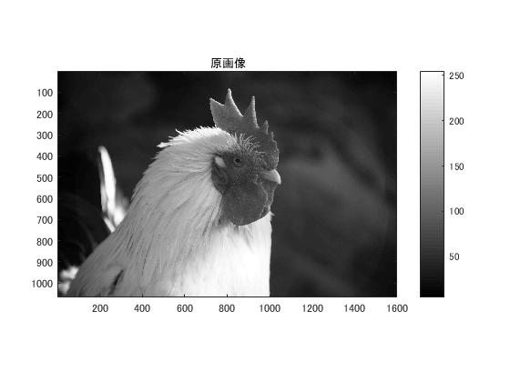
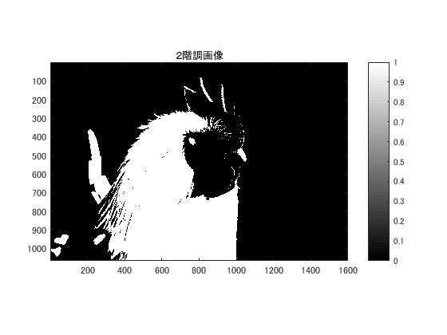
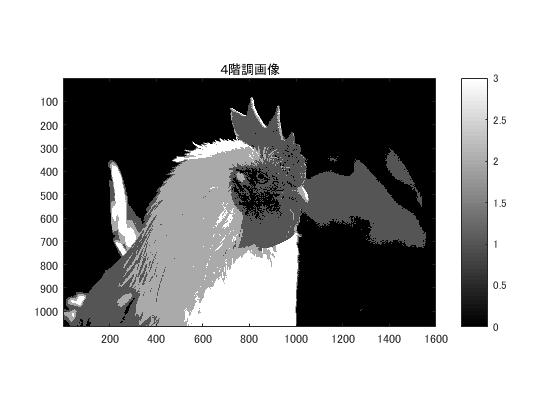
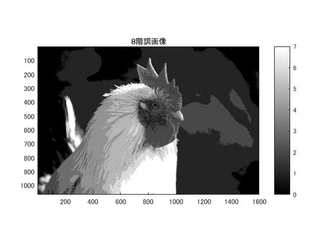

#課題２　階調数と疑似輪郭

「pic1」を原画像とする．この画像は縦画素1600，横画素1066のディジタルカラー画像である．

	ORG=imread('pic1.jpg'); % 原画像の入力
	ORG = rgb2gray(ORG); %グレースケール
	imagesc(ORG); colormap(gray); colorbar; axis image; % 画像の表示

で画像を読み込み，縦横軸とカラーバーと共に原画像の表示を行う．表示した画像を図1に示す．  
  
図1．原画像(白黒濃淡画像)  

	IMG = ORG>128;
	imagesc(IMG); colormap(gray); colorbar;  axis image;
で2階調画像を生成し，表示する．画像の白黒濃淡は0(黒)～255(白)で表されている．全256段階の半分である128を閾値とし，129～255を1(白)とし，0～128を0(黒)の2階調の画像を生成する．  
生成した画像を図2に示す．  
  
図2．2階調画像  

	IMG0 = ORG>64;
	IMG1 = ORG>128;
	IMG2 = ORG>192;
	IMG = IMG0 + IMG1 + IMG2;
	imagesc(IMG); colormap(gray); colorbar;  axis image;
で4階調画像を生成し，表示する．4階調画像は閾値がそれぞれ違う3枚の画像を足し合わせることで生成される．3枚の画像の閾値は全256段階を4分割する数となっている．閾値が64のIMG0は0～64を0(黒)，65～255を1(白)とする画像で，閾値が128のIMG1は0～128を0(黒)，129～255を1(白)とする画像で，閾値が192のIMG2は0～192を0(黒)，193～255を1(白)とする画像である．この3枚の画像を足すと，0～64が0(黒)，65～128が1，129～192が2，193～255が3(白)となり，4階調画像となる．  
生成した画像を図3に示す．  
  
図3．4階調画像  

	IMG0 = ORG>32;
	IMG1 = ORG>64;
	IMG2 = ORG>96;
	IMG3 = ORG>128;
	IMG4 = ORG>160;
	IMG5 = ORG>192;
	IMG6 = ORG>224;
	IMG = IMG0 + IMG1 + IMG2 + IMG3 + IMG4 + IMG5 + IMG6;
	imagesc(IMG); colormap(gray); colorbar;  axis image;
で8階調画像を生成し，表示する．4階調画像と同様に，全256段階を8分割する7つの閾値で生成した7枚の2階調画像を足し合わせることで，0～7段階の数値の8階調画像が生成される．  
生成した画像を図4に示す．  
  
図4．8階調画像  

階調数が低い場合は，決定された濃度間の差が大きくなるため滑らかな濃度差は出なくなる．そのため，本来輪郭のない部分に輪郭状の濃度の段差ができる疑似輪郭が発生したり，本来画素が繋がっていない部分であるのに同じ濃度となってしまい，繋がって見えるようになる．これが，低階調での画像劣化と言える．
この課題での2,4,8階調では8階調が最も階調数は大きいが，それでも輪郭に関する画質劣化は生じている．

この画像の場合，2階調では大まかに顔の部分と体と背景で分かれているだけである．4階調では顔や目が分かるようになるが，影で疑似輪郭が発生している．8階調では影の段階が細かく表現されているので，違和感は4階調ほど発生しておらず，顔や嘴の境界，羽毛の質感もわかるようになっている．
