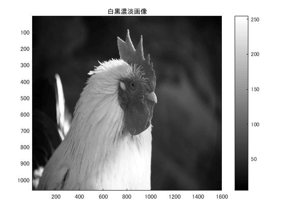
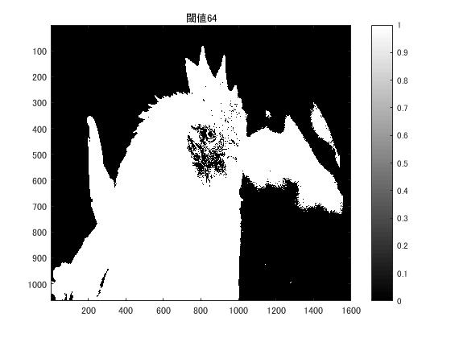
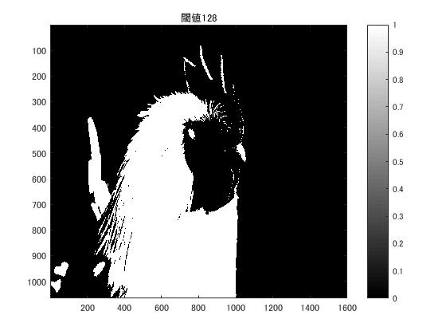
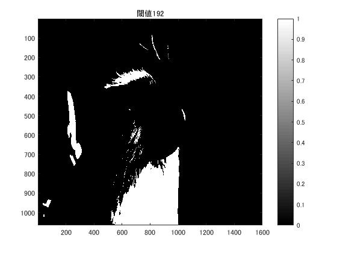

#課題３　閾値処理

「pic1」を原画像とする．この画像は縦画素1600，横画素1066のディジタルカラー画像である．

	ORG=imread('pic1.jpg'); % 原画像の入力
	ORG= rgb2gray(ORG); % カラー画像を白黒濃淡画像へ変換  

	imagesc(ORG); colormap(gray); colorbar; % 画像の表示

で画像を読み込み，縦横軸とカラーバーと共に原画像の表示を行う．表示した画像を図1に示す．  
  
図1．原画像(白黒濃淡画像)  

この課題では，ある値を閾値として定め，その値より大きい輝度の画素を1(白)，それ未満の画素を0(黒)の2値画像を生成する．

	IMG = ORG > 64; % 輝度値が64以上の画素を1，その他を0に変換
	imagesc(IMG); colormap(gray); colorbar;
で閾値を64にして2値画像を生成する．生成した画像を図2に示す．  
  
図2．閾値64の2値画像  

	IMG = ORG > 96;% 輝度値が96以上の画素を1，その他を0に変換
	imagesc(IMG); colormap(gray); colorbar;
で閾値を96にして2値画像を生成する．生成した画像を図3に示す．  
  
図3．閾値96の2値画像  

	IMG = ORG > 128;% 輝度値が128以上の画素を1，その他を0に変換
	imagesc(IMG); colormap(gray); colorbar;
で閾値を128にして2値画像を生成する．生成した画像を図4に示す．  
  
図4．閾値128の2値画像  

	IMG = ORG > 192;% 輝度値が192以上の画素を1，その他を0に変換
	imagesc(IMG); colormap(gray); colorbar;
で閾値を192にして2値画像を生成する．生成した画像を図5に示す．  
  
図5．閾値192の2値画像  

閾値64の画像では，背景の余計な部分まで白くなってしまい，被写体の鶏だけを認識できなくなっているが，目の位置がわかりやすい．  
閾値96の画像では，閾値64で発生していた背景の余計な白部がなくなっており，被写体をはっきり認識でき，嘴も分かりやすくなっている．  
閾値128の画像では，閾値96の画像に比べて鶏の頭の影が分かりやすく，羽毛の質感が出てきている．  
閾値196の画像では，影の部分が広がってしまい，被写体のシルエットの認識がし辛くなっている．  

この4つの2値画像において，閾値64と196はそれぞれ白と黒の部分の面積に偏りが生じ，原画像に比べて見づらい2値画像となっている．
対して，閾値96，128の場合は見やすく，原画像の特徴を比較的残したままの2値画像となっている．
見やすさに関しては原画像によって差が生じるが，0～255の中間値に近い96,128の閾値が見やすくなっていると言える．
