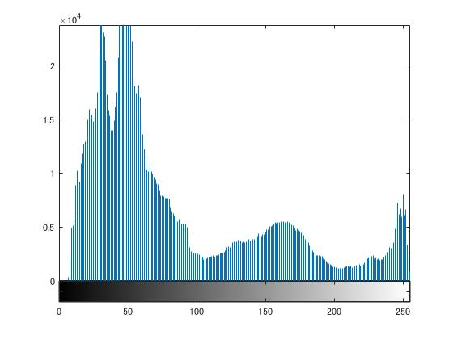

#課題４　画像のヒストグラム

「pic1」を原画像とする．この画像は縦画素1600，横画素1066のディジタルカラー画像である．

	ORG=imread('Lenna.png'); % 原画像の入力
	ORG=rgb2gray(ORG); % カラー画像を白黒濃淡画像へ変換
	imagesc(ORG); colormap(gray); colorbar;

で画像を読み込み，縦横軸とカラーバーと共に原画像の表示を行う．表示した画像を図1に示す．  
  
図1．原画像(白黒濃淡画像)  

	imhist(ORG); % ヒストグラムの表示  

でヒストグラムを表示する．表示したヒストグラムを図2に示す．
  
図2．ヒストグラム  

ヒストグラムは画像中の各濃度値の出現頻度を表すグラフである．縦軸が出現頻度であり，横軸が濃度値を表す．  
この画像では背景が黒く，面積が広いので，0~100の領域の分布が多い．また，被写体の鶏が白いので，250近辺にも山が出来ている．150近辺にも山が出来ているが，これは影部分の分布だと考えられる．これより，画像の概要がヒストグラムから読み取れる．
