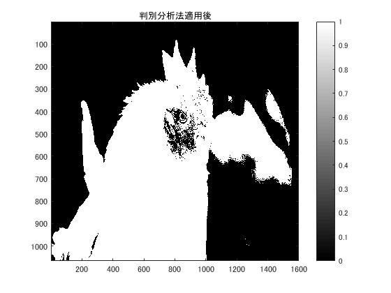

#課題５　判別分析法

「pic1」を原画像とする．この画像は縦画素1600，横画素1066のディジタルカラー画像である．

	ORG=imread('pic1.jpg'); % 原画像の入力
	ORG=rgb2gray(ORG); % カラー画像を白黒濃淡画像へ変換
	imagesc(ORG); colormap(gray); colorbar;

で画像を読み込み，縦横軸とカラーバーと共に原画像の表示を行う．表示した画像を図1に示す．  
  
図1．原画像(白黒濃淡画像)  

この画像を，判別分析法で2値化する．プログラムは，

	H = imhist(ORG); %ヒストグラムのデータを列ベクトルEに格納
	myu_T = mean(H);
	max_val = 0;
	max_thres = 1;
	for i=1:255
	C1 = H(1:i); %ヒストグラムを2つのクラスに分ける
	C2 = H(i+1:256);
	n1 = sum(C1); %画素数の算出
	n2 = sum(C2);
	myu1 = mean(C1); %平均値の算出
	myu2 = mean(C2);
	sigma1 = var(C1); %分散の算出
	sigma2 = var(C2);
	sigma_w = (n1 *sigma1+n2*sigma2)/(n1+n2); %クラス内分散の算出
	sigma_B = (n1 *(myu1-myu_T)^2+n2*(myu2-myu_T)^2)/(n1+n2); %クラス間分散の算出
	if max_val<sigma_B/sigma_w
	max_val = sigma_B/sigma_w;
	max_thres =i;
	end;
	end;

であり，結果は

	IMG = ORG > max_thres;
	imagesc(IMG); colormap(gray); colorbar;

で閾値を適用して2値化し，表示する．結果は図2に示す．
  
図2．判別分析法 2値化画像

判別分析法は，対象物の濃度と背景の濃度がそれぞれよくまとまり，かつそれぞれの違いが際立つ閾値を定める方法である．手順は，  
　1.暫定的に閾値を決める．  
　2.閾値で分けた時の各クラス，つまり対象物と背景の平均値，分散，画素数を計算する．  
　3.計算した6つの値を用いてクラス内分散・クラス間分散を計算する．  
　　クラス内分散：濃度値の分散がそれぞれ近い値でまとまっている事を示す．小さければよい．  
　　クラス間分散：各クラスでの分散が離れているか離れていないか．大きければよい．  
　4.(クラス内分散)/(クラス間分散)　が最大になるように閾値tを定める  
である．  
このプログラムでは，
　1.閾値は1～255までループで逐次変化させて計算を行う．最適値を最終的な閾値として決定する．  
　2.仮閾値iでクラス分割を行い，画素数，平均値，分散をそれぞれMATLABの関数を用いて計算する．  
　3.クラス内，クラス間分散を計算する．  
　4.(クラス内分散)/(クラス間分散)　を計算する．この値が最大値となる閾値が最終的な閾値となる．逐次変化で記録されていた値より大きい場合，記録値を更新する．ループが終了すると，閾値を1～255まで変化させたとき，最も(クラス内分散)/(クラス間分散)が大きい時の閾値が変数に格納されている．  
というように処理されている．  
結果の画像は，被写体のシルエットは認識できるようになっている．しかし，背景に余計な白部分が混ざってしまっている．人間が見ることを考えると，計算のみでは余計なものが混入してしまう可能性もある．
