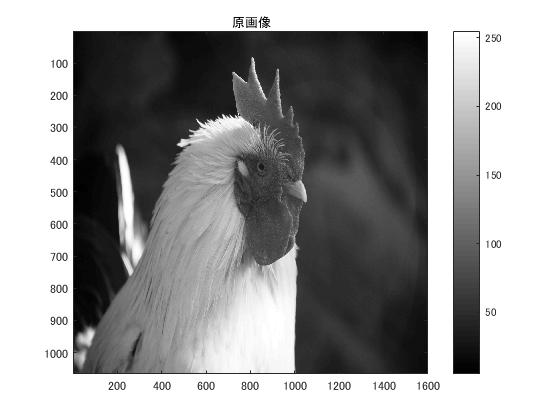
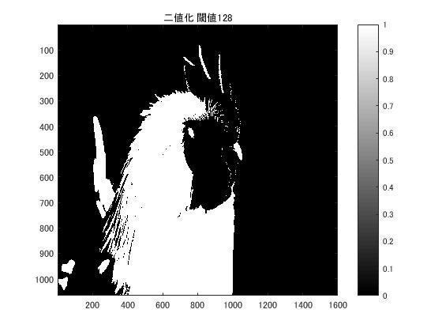
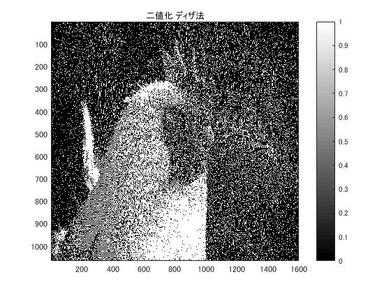

#課題６　画像の二値化

「pic1」を原画像とする．この画像は縦画素1600，横画素1066のディジタルカラー画像である．

	ORG=imread('pic1.jpg'); % 原画像の入力
	ORG=rgb2gray(ORG); % カラー画像を白黒濃淡画像へ変換
	imagesc(ORG); colormap(gray); colorbar;

で画像を読み込み，縦横軸とカラーバーと共に原画像の表示を行う．表示した画像を図1に示す．  
  
図1．原画像(白黒濃淡画像)  

この課題では，2つの方法で2値化する．

	IMG = ORG>128; % 128による二値化
	imagesc(IMG); colormap(gray); colorbar; % 画像の表示
	title('二値化 閾値128')
	pause;
で，閾値を128とした2値画像を生成し，表示する．結果を図2に示す．  
  
図2．閾値128 2値画像  
また，

	IMG = dither(ORG); % ディザ法による二値化
	imagesc(IMG); colormap(gray); colorbar; % 画像の表示
	title('二値化 ディザ法')
で，ディザ法を用いた2値画像を生成し，表示する．結果を図3に示す．  
  
図3．ディザ法 2値画像  

ディザ法は，原画像の濃度値を，画素位置によりあらかじめ定められたディザマトリクスTの値(閾値・ディザパターン)と比較して，その大小関係で出力画素の濃度値を決定する方法である．  

閾値による2値化では，濃度でまとまりが生じてしまい，疑似輪郭などの画質劣化が発生している．  
ディザ法による2値化では，閾値による2値化とは異なり，濃度のまとまりができる訳ではなく，点描画のように白黒がばらけた感じの2値画像となっている．これは，ある一定区間ごとに濃度分布を決めることで2値であるのに疑似的に濃淡があるように見せている方法であると言える．  
画素のまとまりではなく点描画に近いので，目や嘴の位置など大まかな被写体の特徴が分かるようにはなっているが，個別パーツの輪郭や羽毛の質感など細かい部分は読み取りづらい．

