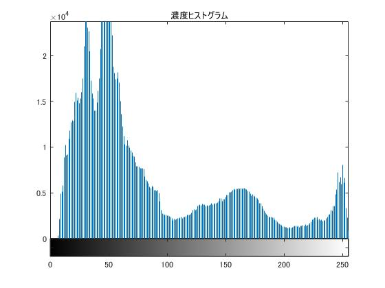
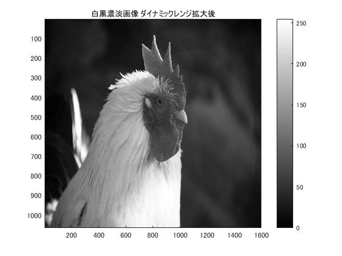
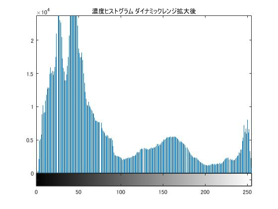

#課題7　ダイナミックレンジの拡大

「pic1」を原画像とする．この画像は縦画素1600，横画素1066のディジタルカラー画像である．

	ORG=imread('pic1.jpg'); % 原画像の入力
	ORG=rgb2gray(ORG); % 白黒濃淡画像へ変換
	imagesc(ORG); colormap(gray); colorbar;

で画像を読み込み，縦横軸とカラーバーと共に原画像の表示を行う．表示した画像を図1に示す．  
  
図1．原画像(白黒濃淡画像)  

ダイナミックレンジの拡大は，画像の濃度値の差を広げることである．ヒストグラムにおいては，使われていない濃度領域へ拡大する．
原画像のヒストグラムを確認し，ダイナミックレンジを拡大，その後，画像とヒストグラムの確認を行う．

	imhist(ORG); % 濃度ヒストグラムを生成、表示
	title('濃度ヒストグラム')
	pause;

で原画像のヒストグラムを表示する．表示したヒストグラムを図2に示す．  
  
図2．原画像　ヒストグラム  

	ORG = double(ORG);
	mn = min(ORG(:)); % 濃度値の最小値を算出
	mx = max(ORG(:)); % 濃度値の最大値を算出
	ORG = (ORG-mn)/(mx-mn)*255;
	imagesc(ORG); colormap(gray); colorbar; % 画像の表示
	title('白黒濃淡画像 ダイナミックレンジ拡大後')
	pause;

でダイナミックレンジを拡大し，画像を表示する．表示した画像を図3に示す．  
  
図3．ダイナミックレンジ拡大後画像  

	ORG = uint8(ORG); % この行について考察せよ
	imhist(ORG); % 濃度ヒストグラムを生成、表示
	title('濃度ヒストグラム ダイナミックレンジ拡大後')

でダイナミックレンジ拡大後のヒストグラムを表示する．表示したヒストグラムを図4に示す．  
  
図4．ダイナミックレンジ拡大後　ヒストグラム  

このプログラムでは，濃度の最大値，最小値を利用した線形変換でダイナミックレンジを拡大している．

uint8(S)はシンボリック行列 S を符号なしの 8 ビット整数からなる行列に変換する関数である．画像は配列，つまり行列として扱われるため，この関数による変換ができる．8ビット整数は，0～255の範囲の値である．この関数による変換は，行列内の値をこの範囲に収めることである．この関数によって，ダイナミックレンジの拡大によって0より小さい，もしくは255より大きい濃度になった値を0～255の範囲内に収め，0～255の値のヒストグラムとして表示させる効果を持つと考えられる．
この画像は元々のヒストグラムの範囲が広いため，拡大しても大きな差は出ないが，よく見ると0近辺の分布がない部分が拡大によって埋まっていることが分かる．
