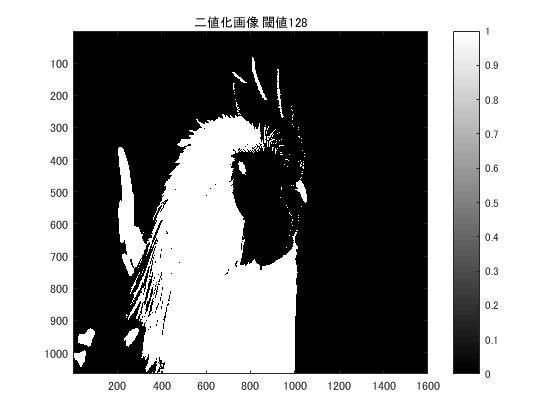
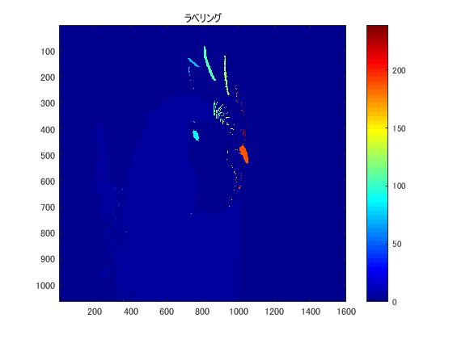

#課題８ ラベリング

「pic1」を原画像とする．この画像は縦画素1600，横画素1066のディジタルカラー画像である．

	ORG=imread('pic1.jpg'); % 原画像の入力
	ORG=rgb2gray(ORG); % 白黒濃淡画像へ変換
	imagesc(ORG); colormap(gray); colorbar;

で画像を読み込み，縦横軸とカラーバーと共に原画像の表示を行う．表示した画像を図1に示す．  
  
図1．原画像(白黒濃淡画像)  

	IMG = ORG > 128; % 閾値128で二値化
	imagesc(IMG); colormap(gray); colorbar; % 画像の表示
	title('二値化画像 閾値128')
	pause;

で原画像を閾値128で二値化して表示する．表示した画像を図2に示す．  
  
図2．2値化画像  

	IMG = bwlabeln(IMG);
	imagesc(IMG); colormap(jet); colorbar; % 画像の表示
	title('ラベリング')
	pause;

で2値化した画像にラベリングを行って表示する．表示した画像を図3に示す．  
  
図3．2値化画像　ラベリング  

ラベリングは，特徴抽出の方法で，同じ連結成分ごとに同一番号を割り振る処理である．  
ラベリングされた画像を見ると，連結成分，つまりまとまりごとに同一番号が割り振られ，色が付けられている．特徴を見ると，2階調画像でありながら疑似的に多階調画像化されているともいえる．
