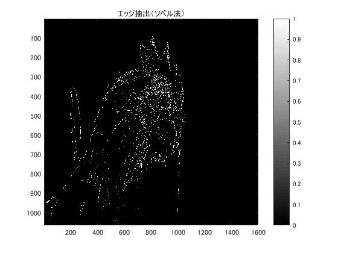
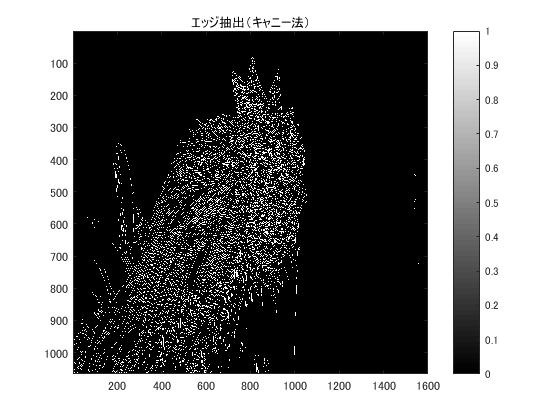

#課題10 画像のエッジ抽出

「pic1」を原画像とする．この画像は縦画素1600，横画素1066のディジタルカラー画像である．

	ORG=imread('pic1.jpg'); % 原画像の入力
	ORG=rgb2gray(ORG); % 白黒濃淡画像へ変換
	imagesc(ORG); colormap(gray); colorbar;

で画像を読み込み，縦横軸とカラーバーと共に原画像の表示を行う．表示した画像を図1に示す．  
  
図1．原画像(白黒濃淡画像)  

この画像のエッジ，つまり輪郭部を3つの手法で抽出する．

	IMG = edge(ORG,'prewitt'); % エッジ抽出（プレウィット法）
	imagesc(IMG); colormap('gray'); colorbar;% 画像表示
	title('エッジ抽出（プレウィット法）')
	pause; % 一時停止

でプレウィット法によるエッジ抽出を行う．結果を図2に示す．  
  
図2．プレウィット法　エッジ抽出  

	IMG = edge(ORG,'sobel'); % エッジ抽出（ソベル法）
	imagesc(IMG); colormap('gray'); colorbar;% 画像表示
	title('エッジ抽出（ソベル法）')
	pause; % 一時停止

でソベル法によるエッジ抽出を行う．結果を図3に示す．  
  
図3．ソベル法　エッジ抽出  

	IMG = edge(ORG,'canny'); % エッジ抽出（キャニー法）
	imagesc(IMG); colormap('gray'); colorbar;% 画像表示
	title('エッジ抽出（キャニー法）')
	pause; % 一時停止

でキャニー法によるエッジ抽出を行う．結果を図4に示す．  
  
図4．キャニー法　エッジ抽出  

エッジ抽出の結果は，エッジが白(1)，それ以外が黒(0)で表示される．  
プレウィット法とソベル法の間には大きな差は見られないが，キャニー法はその2つとは違った結果になっている．細かいエッジも検出できているキャニー法の方が性能はいいと言える．しかし，この画像においては細かい特徴の密集地帯においてもエッジを検出しているため，見づらいともいえる．
